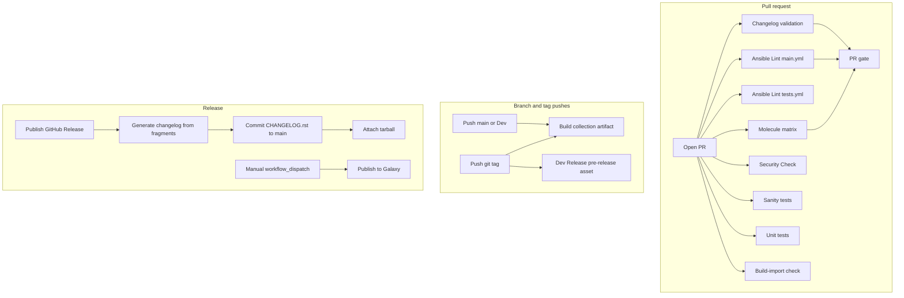
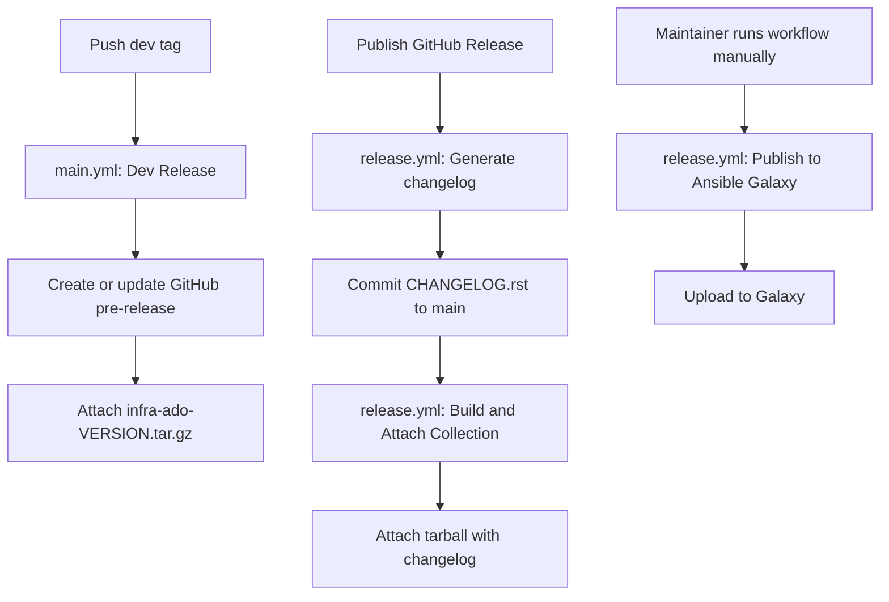

# GitHub Actions and CI/CD

This document is the maintainer and developer guide for the `infra.ado` Ansible
collection pipeline. It covers pull request checks, local validation, Molecule
testing, collection builds, dev pre-releases, official GitHub Releases, and manual
Ansible Galaxy publishing.

## Table of contents

- [Overview](#overview)
- [Repository layout](#repository-layout)
- [Workflow summary](#workflow-summary)
- [End-to-end pipeline](#end-to-end-pipeline)
- [Contributing and pull requests](#contributing-and-pull-requests)
- [Changelog requirements](#changelog-requirements)
- [Ansible Collection CI/CD (`main.yml`)](#ansible-collection-cicd-mainyml)
- [CI (`tests.yml`)](#ci-testsyml)
- [Security Check (`security-check.yml`)](#security-check-security-checkyml)
- [Molecule testing](#molecule-testing)
- [Local development checklist](#local-development-checklist)
- [Collection build jobs](#collection-build-jobs)
- [Shared build action](#shared-build-action)
- [Release pipeline](#release-pipeline)
- [How to do a release](#how-to-do-a-release)
- [Tag and versioning conventions](#tag-and-versioning-conventions)
- [Secrets, environments, and permissions](#secrets-environments-and-permissions)
- [Workflow artifacts](#workflow-artifacts)
- [Troubleshooting](#troubleshooting)
- [Maintainer notes](#maintainer-notes)

## Overview

The repository uses four GitHub Actions workflows:

| Workflow | Primary audience | Role |
| --- | --- | --- |
| **Ansible Collection CI/CD** | Contributors and maintainers | Primary integration pipeline: changelog, lint, Molecule, build, dev pre-releases |
| **CI** | Contributors | Upstream Ansible collection checks: sanity, unit, build-import, lint |
| **Security Check** | Contributors | Role security and data-exposure scans |
| **Release infra.ado** | Maintainers | Attach tarballs to GitHub Releases; manual Galaxy publish |

Most day-to-day development is validated by **Ansible Collection CI/CD** on pull
requests. The **CI** workflow runs in parallel with overlapping checks. Treat both as
signals until required status checks are configured in the repository settings.

## Repository layout

Paths most relevant to the pipeline:

| Path | Purpose |
| --- | --- |
| [`.github/workflows/main.yml`](workflows/main.yml) | Primary CI/CD workflow |
| [`.github/workflows/tests.yml`](workflows/tests.yml) | Upstream collection CI workflow |
| [`.github/workflows/security-check.yml`](workflows/security-check.yml) | Standalone security scans |
| [`.github/workflows/release.yml`](workflows/release.yml) | Release asset and Galaxy publish |
| [`.github/actions/build-collection/`](actions/build-collection/) | Shared tag-versioned collection build |
| [`.github/actions/generate-changelog/`](actions/generate-changelog/) | Compile changelog fragments into `CHANGELOG.rst` |
| [`extensions/molecule/`](../extensions/molecule/) | Integration test scenarios |
| [`extensions/molecule/pr_exclude.txt`](../extensions/molecule/pr_exclude.txt) | Scenarios skipped on PR CI |
| [`changelogs/fragments/`](../changelogs/fragments/) | Per-PR changelog fragments |
| [`changelogs/config.yaml`](../changelogs/config.yaml) | antsibull-changelog configuration |
| [`galaxy.yml`](../galaxy.yml) | Collection namespace, name, and version |
| [`collections/requirements.yml`](../collections/requirements.yml) | Dependency collections for lint and CI |
| [`scripts/validate_changelog.py`](../scripts/validate_changelog.py) | Local changelog validation |
| [`scripts/verify_readme.py`](../scripts/verify_readme.py) | Role README format checks |
| [`scripts/security_checks.py`](../scripts/security_checks.py) | Role security scanning |
| [`scripts/security_data_exposure_scan.py`](../scripts/security_data_exposure_scan.py) | Sensitive data exposure scan |
| [`docs/templates/role_readme_format_template.md`](../docs/templates/role_readme_format_template.md) | Role README template |

## Workflow summary

| Workflow | File | Triggers | Jobs |
| --- | --- | --- | --- |
| Ansible Collection CI/CD | [`main.yml`](workflows/main.yml) | `push`, `pull_request`, `workflow_dispatch` | Changelog, lint, README check, security (manual), Molecule, PR gate, build, dev release |
| CI | [`tests.yml`](workflows/tests.yml) | PR to `main`, `workflow_dispatch` | Changelog, build-import, lint, README, sanity, unit, all_green |
| Security Check | [`security-check.yml`](workflows/security-check.yml) | `pull_request`, `workflow_dispatch` | Security and data-exposure scans |
| Release infra.ado | [`release.yml`](workflows/release.yml) | Release published, `workflow_dispatch` | Generate changelog, build and attach asset, publish to Galaxy |

Status badges:

- [Ansible Collection CI/CD](https://github.com/Automation-Development-Office/ado/actions/workflows/main.yml)
- [Security Check](https://github.com/Automation-Development-Office/ado/actions/workflows/security-check.yml)

## End-to-end pipeline



## Contributing and pull requests

Use the [pull request template](pull_request_template.md) when opening a PR. At minimum:

1. Describe what changed and why
2. List affected roles, scenarios, or workflow paths
3. Record how you tested the change
4. Add a changelog fragment when required (see below)

### What blocks merge today

The **PR gate** in `main.yml` requires these jobs to pass on pull requests:

| Job | Enforced |
| --- | --- |
| Ansible Lint (`main.yml`) | Yes |
| Discover Molecule Scenarios | Yes (must find at least one scenario) |
| Molecule matrix | Yes |
| Changelog | Yes, unless PR has `skip-changelog` label |
| README format check | No (informational) |
| Security Check (`security-check.yml`) | No (informational) |
| CI workflow `all_green` | Partial (unit-galaxy and ansible-lint only) |

Configure branch protection in GitHub to match the jobs you want to enforce.

### PR labels

| Label | Effect |
| --- | --- |
| `skip-changelog` | Skips changelog validation in `main.yml` |

## Changelog requirements

This collection uses [antsibull-changelog](https://github.com/ansible-community/antsibull-changelog).
Do not edit `CHANGELOG.rst` or `changelogs/changelog.yaml` directly in normal PRs.

### When to add a fragment

Add a new file under [`changelogs/fragments/`](../changelogs/fragments/) when a PR:

- Modifies an existing role, plugin, or module
- Changes CI, release, or workflow behavior that affects maintainers or consumers
- Fixes a user-visible bug or makes a notable documentation change

A fragment is **not** required for:

- New plugins or modules (first addition)
- Documentation-only changes to existing content
- Truly trivial internal changes with no user impact

### Fragment format

Use sections defined in [`changelogs/config.yaml`](../changelogs/config.yaml):

```yaml
minor_changes:
  - my_role - Added support for example configuration.
bugfixes:
  - my_role - Fixed handler notification when ``my_var`` is unset.
breaking_changes:
  - my_role - Renamed ``old_var`` to ``new_var``.
doc_changes:
  - ci - Documented the release pipeline in ``.github/README.md``.
```

Prefix entries with the affected component (`role_name`, `ci`, FQCN, etc.).

### Validate locally

```bash
python3 scripts/validate_changelog.py --ref main
```

### Release PRs (optional)

You no longer need a dedicated release PR to compile changelog fragments. When a GitHub
Release is published, the pipeline runs `antsibull-changelog release` automatically.

A manual release PR is still valid if you prefer to review `CHANGELOG.rst` before
tagging. That PR should only modify `CHANGELOG.rst`, `changelogs/changelog.yaml`, and
`galaxy.yml`, and delete consumed fragment files.

## Ansible Collection CI/CD (`main.yml`)

Primary workflow for integration testing and collection builds.

### Triggers

| Event | Jobs that run |
| --- | --- |
| `pull_request` | Changelog, lint, README check, Molecule, PR gate |
| `push` to feature branch | Lint only |
| `push` to `main` or `Dev` | Build collection artifact |
| `push` tag | Build artifact, dev pre-release |
| `workflow_dispatch` | Selected Molecule scenarios, README check, security check |

### Job reference

#### Changelog

- **Runs on:** pull requests without `skip-changelog`
- **Action:** `ansible/ansible-content-actions` changelog validator
- **Checkout:** PR head SHA with full history (`fetch-depth: 0`)

#### Ansible Lint

- **Runs on:** pull requests; pushes to branches other than `main`, `Dev`, and tags
- **Container:** `registry.gitlab.com/pipeline-components/ansible-lint:latest`
- **Collections:** installs [`collections/requirements.yml`](../collections/requirements.yml) with retry logic
- **Output:** `ansible-lint-report` artifact (JUnit XML)
- **Note:** lint step uses `continue-on-error: true` but the PR gate still requires the job result to be `success`. Failures must be fixed before merge.

#### README Format Verification

- **Runs on:** pull requests; manual dispatch when `run_readme_verification` is true
- **Script:** `scripts/verify_readme.py` against [`docs/templates/role_readme_format_template.md`](../docs/templates/role_readme_format_template.md)
- **Status:** informational (`continue-on-error: true`), not in PR gate

#### Security Check (in `main.yml`)

- **Runs on:** manual dispatch only when `run_security_checks` is true
- **Scripts:** `security_checks.py` and `security_data_exposure_scan.py` on `roles/`
- **Note:** pull requests use the standalone [`security-check.yml`](#security-check-security-checkyml) workflow instead

#### Discover Molecule Scenarios

- **Runs on:** pull requests and manual dispatch
- **Discovery:** finds `extensions/molecule/*/molecule.yml` at depth 2
- **PR exclusions:** reads [`extensions/molecule/pr_exclude.txt`](../extensions/molecule/pr_exclude.txt)
- **Manual dispatch:** includes only scenarios whose boolean input is `true`, plus all `ocp_*` scenarios when `run_ocp_scenarios` is enabled

#### Molecule

- **Runs on:** pull requests and manual dispatch when scenarios were discovered
- **Strategy:** `fail-fast: false` matrix over discovered scenarios
- **Dependencies:** `ansible-core`, `molecule-plugins[docker,podman]`, `docker`, `podman`, `qemu-utils`
- **Collections installed:** local collection, `ansible.posix`, `community.general`, `containers.podman`, plus per-scenario `requirements.yml` when present
- **Execution:** `molecule test -s <scenario>` from `extensions/molecule/`
- **Output:** per-scenario `molecule-report-<scenario>` artifact with log and summary

#### PR Gate

- **Runs on:** pull requests
- **Requires:** lint, scenario discovery, and all Molecule jobs succeeded
- **Requires:** at least one Molecule scenario in the matrix

#### Prepare Build Variables

- **Runs on:** push to `main`, `Dev`, or any tag
- **Output:** `version`, `name`, `namespace` from [`galaxy.yml`](../galaxy.yml)

#### Build Collection

- **Runs on:** push to `main`, `Dev`, or any tag
- **Tag builds:** syncs `galaxy.yml` version from tag name (strips optional `v`)
- **Command:** `ansible-galaxy collection build --force --output-path .`
- **Output:** `collection-build` artifact (90-day retention)

#### Dev Release

- **Runs on:** tag push only
- **Permissions:** `contents: write`
- **Build:** shared [`build-collection`](#shared-build-action) action
- **Publish:** creates a GitHub pre-release or uploads tarball with `--clobber` if the release already exists

### Manual dispatch inputs

Open **Actions → Ansible Collection CI/CD → Run workflow** to run individual scenarios or
checks. Available boolean inputs:

| Input | Scenario or check |
| --- | --- |
| `run_readme_verification` | README format check (default: true) |
| `run_security_checks` | Security and data-exposure scans |
| `run_ocp_scenarios` | All `ocp_*` Molecule scenarios |
| `run_integration_vm_image_management` | `integration_vm_image_management` |
| `run_integration_aap_build_ee` | `integration_aap_build_ee` |
| `run_integration_aap_configuration` | `integration_aap_configuration` |
| `run_integration_rhel_patching` | `integration_rhel_patching` |
| `run_integration_rhel_cron_full_special` | `integration_rhel_cron_full_special` |
| `run_integration_rhel_cron_full_special_removal` | `integration_rhel_cron_full_special_removal` |
| `run_integration_rhel_cron_single_special` | `integration_rhel_cron_single_special` |
| `run_integration_rhel_cron_single_special_removal` | `integration_rhel_cron_single_special_removal` |
| `run_integration_rhel_mount_mount_auto_detect` | `integration_rhel_mount_mount_auto_detect` |
| `run_integration_rhel_mount_mount_explicit_fstype` | `integration_rhel_mount_mount_explicit_fstype` |
| `run_integration_rhel_mount_remove_from_fstab` | `integration_rhel_mount_remove_from_fstab` |
| `run_integration_rhel_mount_unmount_filesystem` | `integration_rhel_mount_unmount_filesystem` |
| `run_rhel_repos_default` | `integration_rhel_repos_default` |
| `run_rhel_repos_rhsm` | `integration_rhel_repos_rhsm` |
| `run_integration_satellite_content_view_create` | `integration_satellite_content_view_create` |
| `run_integration_satellite_content_view_publish` | `integration_satellite_content_view_publish` |
| `run_integration_satellite_content_view_promote` | `integration_satellite_content_view_promote` |

## CI (`tests.yml`)

Secondary workflow using upstream [`ansible-content-actions`](https://github.com/ansible/ansible-content-actions)
reusable workflows. Runs on pull requests targeting `main` and on manual dispatch.

| Job | Purpose | Notes |
| --- | --- | --- |
| `changelog` | Upstream changelog validation | PR only |
| `build-import` | Build and galaxy-importer smoke test | Always runs |
| `ansible-lint` | Lint with Python 3.14 | Offline mode |
| `readme-format` | README verification | Informational |
| `sanity` | Ansible sanity tests | Upstream reusable workflow |
| `unit-galaxy` | Unit tests | Upstream reusable workflow |
| `unit-source` | Disabled (`if: false`) | Reserved for future use |
| `all_green` | Aggregate gate | Checks `unit-galaxy` and `ansible-lint` only |

Concurrency is enabled per PR branch (`cancel-in-progress: true`).

## Security Check (`security-check.yml`)

Standalone workflow for security review. Runs automatically on every pull request and
can be re-run manually.

| Step | Script | Scope |
| --- | --- | --- |
| Security check | `scripts/security_checks.py` | `roles/` |
| Data exposure scan | `scripts/security_data_exposure_scan.py` | `roles/` |

Outputs:

- Job summary dashboards (Markdown)
- `security-check-report` artifact (text, JSON, and summary files)

Status: informational only. Not enforced by the PR gate yet.

Run locally:

```bash
python3 scripts/security_checks.py roles/<role_name>
python3 scripts/security_data_exposure_scan.py roles/<role_name>
```

## Molecule testing

Integration scenarios live under [`extensions/molecule/`](../extensions/molecule/).

### PR CI behavior

On pull requests, `main.yml` discovers all scenarios with a `molecule.yml` file and runs
them in parallel, except those listed in
[`pr_exclude.txt`](../extensions/molecule/pr_exclude.txt):

| Pattern | Reason |
| --- | --- |
| `ocp_*` | Requires live OpenShift cluster and `K8S_AUTH_*` secrets |
| `install_aap`, `install_dirsrv`, `install_elastic`, `install_postfix`, `install_rhbk` | Long-running or environment-specific installs |
| `integration_rhel_repos_rhsm` | Requires RHSM credentials |
| `integration_bootstrap_generate_content` | Environment-specific bootstrap test |

Excluded scenarios can still be run locally or via `workflow_dispatch`.

### OpenShift scenarios

To run `ocp_*` scenarios in CI:

1. Configure repository secrets:
   - `K8S_AUTH_HOST`
   - `K8S_AUTH_API_KEY`
   - `K8S_AUTH_VERIFY_SSL`
2. Open **Actions → Ansible Collection CI/CD → Run workflow**
3. Enable **Run all ocp_* Molecule scenarios**

### Run a scenario locally

From the collection root:

```bash
ansible-galaxy collection install . --force -p ~/.ansible/collections
ansible-galaxy collection install ansible.posix community.general containers.podman \
  --force -p ~/.ansible/collections
export ANSIBLE_COLLECTIONS_PATH="$HOME/.ansible/collections:/usr/share/ansible/collections"

cd extensions/molecule
ln -sfn . molecule
molecule test -s <scenario_name>
```

Per-scenario dependency collections may be declared in
`extensions/molecule/<scenario>/requirements.yml`.

## Local development checklist

Before opening a PR:

```bash
# Changelog (if required)
python3 scripts/validate_changelog.py --ref main

# Role README format (if a role README changed)
python3 scripts/verify_readme.py roles/<role>/README.md \
  --template docs/templates/role_readme_format_template.md

# Security (if role content changed)
python3 scripts/security_checks.py roles/<role_name>
python3 scripts/security_data_exposure_scan.py roles/<role_name>

# Lint
ansible-galaxy collection install -r collections/requirements.yml \
  -p .ansible/collections
ANSIBLE_COLLECTIONS_PATH=.ansible/collections ansible-lint --offline

# Molecule (if applicable)
cd extensions/molecule && ln -sfn . molecule && molecule test -s <scenario>
```

Install the collection locally for ad hoc testing:

```bash
ansible-galaxy collection install . --force -p ~/.ansible/collections
```

## Collection build jobs

### Branch and tag builds (`prepare` + `build`)

Triggered by pushes to `main`, `Dev`, or any git tag.

1. `prepare` reads `namespace`, `name`, and `version` from [`galaxy.yml`](../galaxy.yml)
2. `build` runs `ansible-galaxy collection build`
3. On tags, `galaxy.yml` `version` is temporarily set from the tag name
4. Result is uploaded as the `collection-build` workflow artifact

This artifact is for CI inspection. It is **not** attached to a GitHub Release unless
you also push a tag (dev pre-release) or publish a GitHub Release.

### Dev pre-releases (`release_dev`)

Triggered by any tag push. Uses the shared build action and:

1. Builds `infra-ado-<version>.tar.gz`
2. Creates a GitHub **pre-release** if one does not exist
3. Uploads or replaces the tarball on that release

Dev pre-releases compile a **changelog preview** from fragments without consuming them.
The GitHub pre-release notes and a `CHANGELOG-preview.rst` asset show what the official
release changelog will look like.

## Shared build action

[`actions/build-collection/action.yml`](actions/build-collection/action.yml) centralizes
tag-versioned builds for release jobs.

**Inputs:**

| Input | Description |
| --- | --- |
| `tag` | Git tag name, for example `v1.2.0-beta1` |

**Outputs:**

| Output | Description |
| --- | --- |
| `version` | Tag with optional `v` prefix removed |
| `tarball` | Built artifact filename, for example `infra-ado-1.2.0-beta1.tar.gz` |

**Behavior:**

1. Set `galaxy.yml` `version` from the tag
2. Leave `namespace` (`infra`) and `name` (`ado`) unchanged
3. Run `ansible-galaxy collection build --force --output-path .`

Used by:

- `main.yml` → `release_dev`
- `release.yml` → `release_assets`
- `release.yml` → `publish_galaxy`

## Generate changelog action

[`actions/generate-changelog/action.yml`](actions/generate-changelog/action.yml) compiles
accumulated changelog fragments into release notes before the collection tarball is built.

**Inputs:**

| Input | Description |
| --- | --- |
| `tag` | Git tag name, for example `v1.2.0` |
| `commit_to_main` | Push generated `CHANGELOG.rst` and `changelogs/changelog.yaml` to `main` (default: `true`) |

**Behavior:**

1. If the release version is already recorded in `changelogs/changelog.yaml`, render outputs only
2. Otherwise, if `origin/main` already contains the release entry, sync those changelog files into the build workspace
3. Otherwise, if fragments exist under `changelogs/fragments/`, run `antsibull-changelog release --version <version>`
4. Render `CHANGELOG.rst` and per-release notes with `antsibull-changelog generate`
5. Consumed fragments are removed (`keep_fragments: false` in [`changelogs/config.yaml`](../changelogs/config.yaml))
6. When `commit_to_main` is `true`, the generated changelog is committed and pushed to `main`

Set `consume_fragments: false` to sync an already-compiled changelog without deleting fragments.

Used by:

- `release.yml` → `release_assets` when `prerelease: false`
- `release.yml` → `publish_galaxy` with `consume_fragments: false`

## Preview changelog action

[`actions/preview-changelog/action.yml`](actions/preview-changelog/action.yml) builds a
read-only changelog preview for dev pre-releases.

**Behavior:**

1. Copies changelog data into a temporary workspace with `keep_fragments: true`
2. Runs `antsibull-changelog release --version` and `generate` without modifying the repository
3. Writes `changelog-preview-notes.rst` (release notes) and `CHANGELOG-preview.rst`
4. `release_dev` uses these files for GitHub pre-release notes and uploads the preview asset
5. Verifies repository fragment files are unchanged after the preview run

Fragments are **never** deleted by this action.

Used by:

- `main.yml` → `release_dev`
- `release.yml` → `release_assets` when `prerelease: true`

## Release pipeline

Collection releases are versioned from git tags. The version inside the tarball always
matches the tag name, with an optional leading `v` removed.



### Automatic steps

| Event | Workflow | Fragments consumed? | Result |
| --- | --- | --- | --- |
| Push a dev tag | `main.yml` | **No** | Pre-release with changelog preview only |
| Publish a GitHub pre-release | `release.yml` | **No** | Changelog preview attached; fragments remain |
| Publish an official GitHub Release | `release.yml` | **Yes** | Fragments compiled, deleted, and committed to `main` |

### Manual steps

| Step | How |
| --- | --- |
| Publish to Ansible Galaxy | **Actions → Release infra.ado → Run workflow** with tag input |

Galaxy publish does **not** run automatically when a GitHub Release is published.

## How to do a release

### 1. Land changes through normal PRs

1. Merge feature PRs with changelog fragments as needed
2. Ensure CI is green on `main`

Fragments accumulate under `changelogs/fragments/` until a GitHub Release is published.
You do **not** need to manually run `antsibull-changelog release` before tagging unless
you want to preview the compiled changelog in a PR.

### 2. Create a dev pre-release (optional)

Tag and push a pre-release version:

```bash
git tag v1.2.0-beta1
git push origin v1.2.0-beta1
```

GitHub Actions will:

- Build `infra-ado-1.2.0-beta1.tar.gz`
- Create or update a GitHub pre-release
- Attach the tarball

Install without cloning:

```bash
ansible-galaxy collection install \
  https://github.com/Automation-Development-Office/ado/releases/download/v1.2.0-beta1/infra-ado-1.2.0-beta1.tar.gz
```

Re-pushing a tag or re-running the workflow replaces the asset with `--clobber`.

Dev pre-releases do not compile changelog fragments. Fragments remain for the official
release.

### 3. Publish an official GitHub Release

When the dev build is validated:

1. Open the repository **Releases** page
2. Create or edit the release for the target tag
3. Uncheck **Set as a pre-release** for an official release
4. Publish the release

`release.yml` will automatically:

1. Run `antsibull-changelog release` against the accumulated fragments
2. Commit `CHANGELOG.rst` and `changelogs/changelog.yaml` to `main`
3. Build `infra-ado-<version>.tar.gz` (including the generated changelog)
4. Attach the tarball to the GitHub Release

### 4. Publish to Ansible Galaxy (manual)

When the GitHub Release is ready for public distribution:

1. Open **Actions → Release infra.ado**
2. Click **Run workflow**
3. Enter the tag, for example `v1.2.0`
4. Start the run

Requires the `release` GitHub Environment and `ANSIBLE_GALAXY_API_KEY` secret.

If the GitHub Release workflow already ran, the manual Galaxy job syncs the generated
changelog from `main` before building the collection tarball.

### 5. Verify

- [ ] `CHANGELOG.rst` on `main` contains the release version
- [ ] Consumed fragment files were removed from `changelogs/fragments/`
- [ ] GitHub Release contains `infra-ado-<version>.tar.gz`
- [ ] `ansible-galaxy collection install <release-url>` succeeds
- [ ] After Galaxy publish, version appears at [galaxy.ansible.com/infra/ado](https://galaxy.ansible.com/infra/ado)

## Tag and versioning conventions

| Topic | Convention |
| --- | --- |
| Tag format | `v1.2.0` or `1.2.0` (leading `v` is optional) |
| Built version | Tag name with leading `v` removed |
| Dev tags | Use pre-release identifiers, for example `v1.2.0-beta1`, `v1.2.0-rc1` |
| Official tags | Use clean semver, for example `v1.2.0` |
| Namespace and name | Always from [`galaxy.yml`](../galaxy.yml); only `version` is overridden at build time |
| Artifact name | `infra-ado-<version>.tar.gz` |

## Secrets, environments, and permissions

### Secrets

| Secret | Used by | Required for |
| --- | --- | --- |
| `GITHUB_TOKEN` | Automatic release jobs | Creating pre-releases and uploading release assets |
| `ANSIBLE_GALAXY_API_KEY` | Manual Galaxy publish | Publishing to Ansible Galaxy |
| `K8S_AUTH_HOST` | OpenShift Molecule scenarios | OpenShift API endpoint |
| `K8S_AUTH_API_KEY` | OpenShift Molecule scenarios | OpenShift API token |
| `K8S_AUTH_VERIFY_SSL` | OpenShift Molecule scenarios | TLS verification for OpenShift API |

### Environments

| Environment | Used by | Purpose |
| --- | --- | --- |
| `release` | `publish_galaxy` job | Gates access to `ANSIBLE_GALAXY_API_KEY` |

### Permissions

| Job | Permission |
| --- | --- |
| `release_dev` | `contents: write` (job-level) |
| `release.yml` | `contents: write` (workflow-level) |
| All other jobs | Default `GITHUB_TOKEN` read access |

## Workflow artifacts

| Artifact | Produced by | Retention | Contents |
| --- | --- | --- | --- |
| `ansible-lint-report` | `main.yml` lint | Default | JUnit XML lint results |
| `readme-verification-report` | `main.yml`, `tests.yml` | 30 days | README format check output |
| `security-check-report` | `main.yml` (manual), `security-check.yml` | 30 days | Security and data-exposure reports |
| `molecule-report-<scenario>` | `main.yml` Molecule | Default | Per-scenario log and summary |
| `collection-build` | `main.yml` build | 90 days | `infra-ado-*.tar.gz` from branch or tag push |

Download artifacts from the workflow run summary page in GitHub Actions.

## Troubleshooting

### Changelog validation failed

- Add a fragment under `changelogs/fragments/` or apply the `skip-changelog` label if no entry is needed
- Validate locally: `python3 scripts/validate_changelog.py --ref main`
- Ensure fragment sections match [`changelogs/config.yaml`](../changelogs/config.yaml)

### Molecule scenario missing from PR CI

- Confirm `extensions/molecule/<scenario>/molecule.yml` exists
- Check whether the scenario is excluded in [`pr_exclude.txt`](../extensions/molecule/pr_exclude.txt)
- Run it manually via **Actions → Ansible Collection CI/CD → Run workflow**

### Molecule passed locally but failed in CI

- Ensure collection dependencies are installed (`collections/requirements.yml`, scenario `requirements.yml`)
- Check whether the scenario needs secrets or external infrastructure (OpenShift, RHSM, etc.)
- Review the `molecule-report-<scenario>` artifact from the failed run

### Lint passed in `tests.yml` but failed in `main.yml`

Both workflows run `ansible-lint` with different configurations (container image, Python version, online/offline mode). Fix all reported issues and re-run both workflows.

### Tag push did not create a pre-release

- Confirm the tag push triggered **Ansible Collection CI/CD**
- Check the **Dev Release** job logs for `gh release create` or `gh release upload` errors
- Verify the workflow has `contents: write` permission

### GitHub Release published but no tarball attached

- Confirm **Release infra.ado** ran its **Build and Attach Collection** job
- Check that the release was **published**, not merely saved as a draft
- Review `release_assets` job logs for build or upload failures

### Galaxy publish failed

- Confirm you ran **Release infra.ado** manually with the correct tag
- Verify `ANSIBLE_GALAXY_API_KEY` is set in the `release` environment
- Ensure the tag exists and the collection version has not already been published

### Wrong tarball name or namespace

- Namespace and name come from [`galaxy.yml`](../galaxy.yml) and should be `infra` and `ado`
- Only `version` is set from the tag at build time
- Expected artifact: `infra-ado-<version>.tar.gz`

## Maintainer notes

### Overlapping CI workflows

`main.yml` and `tests.yml` both run on pull requests to `main` with overlapping lint and
changelog checks. This is intentional scaffolding from `ansible-creator`. When configuring
required status checks, pick the jobs that best match your merge policy or consolidate
workflows in a future cleanup.

### Informational checks

These provide signal but do not block the PR gate today:

- README format verification
- Security Check (`security-check.yml`)
- `tests.yml` `readme-format` and commented-out `changelog` in `all_green`

Enable them as required checks when the team is ready to enforce them.

### Pre-commit hooks

Local formatting and lint hooks are configured in [`.pre-commit-config.yaml`](../.pre-commit-config.yaml)
(black, isort, prettier, trailing commas). Run `pre-commit run --all-files` before pushing.

### Future improvements

- Consolidate duplicate lint and changelog jobs between `main.yml` and `tests.yml`
- Add `galaxy-importer` validation to the release build path
- Enforce README and security checks in the PR gate
- Add Automation Hub publish support alongside Galaxy
