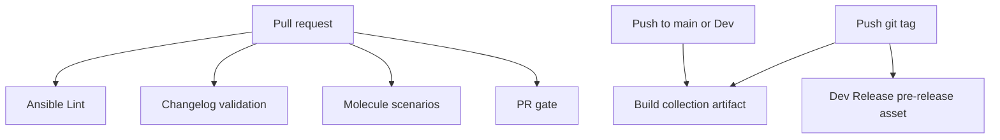
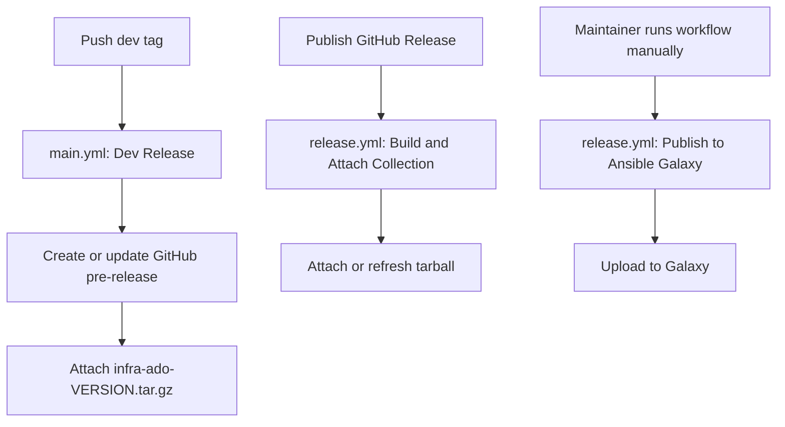

# GitHub Actions

This directory contains the CI/CD and release automation for the `infra.ado` Ansible
collection.

## Workflows

| Workflow | File | Triggers | Purpose |
| --- | --- | --- | --- |
| Ansible Collection CI/CD | [`workflows/main.yml`](workflows/main.yml) | Push, pull request, `workflow_dispatch` | Lint, Molecule, collection build, dev pre-releases |
| Release infra.ado | [`workflows/release.yml`](workflows/release.yml) | GitHub Release published, `workflow_dispatch` | Attach release tarballs, manual Galaxy publish |
| CI | [`workflows/tests.yml`](workflows/tests.yml) | Pull request to `main`, `workflow_dispatch` | Upstream sanity, unit, build-import checks |
| Security Check | [`workflows/security-check.yml`](workflows/security-check.yml) | Pull request, `workflow_dispatch` | Security and data-exposure scans |

## Shared build action

[`actions/build-collection/action.yml`](actions/build-collection/action.yml) is used by
release jobs to:

1. Read the git tag name and set `galaxy.yml` `version` (strips an optional `v` prefix)
2. Leave `namespace` and `name` unchanged in [`galaxy.yml`](../galaxy.yml)
3. Run `ansible-galaxy collection build --force --output-path .`

The resulting tarball is named `infra-ado-<version>.tar.gz`.

## CI pipeline



### Pull requests

On every pull request, `main.yml` runs:

- **Changelog** — validates antsibull-changelog fragments unless the PR has the
  `skip-changelog` label
- **Ansible Lint** — lints collection content
- **Molecule** — runs scenarios under `extensions/molecule/`, excluding entries in
  `extensions/molecule/pr_exclude.txt`
- **PR gate** — requires lint and Molecule jobs to pass

The standalone **Security Check** workflow also runs on pull requests. It is informational
only and is not part of the PR gate yet.

### Branch pushes

Pushes to `main` or `Dev` build the collection and upload a workflow artifact named
`collection-build`. This artifact is for CI debugging and is not attached to a GitHub
Release.

### Manual CI runs

Use **Actions → Ansible Collection CI/CD → Run workflow** to run individual Molecule
scenarios, README verification, or security checks. See the root
[`README.md`](../README.md#testing) for details.

## Release pipeline

Collection releases are versioned from git tags. The collection version inside the
tarball always matches the tag name, with an optional leading `v` removed.



### What is automatic

| Event | What happens |
| --- | --- |
| Push a git tag | `main.yml` builds the collection and creates or updates a GitHub **pre-release** with the tarball attached |
| Publish a GitHub Release | `release.yml` builds the collection and attaches or refreshes the tarball on that release |

### What is manual

Ansible Galaxy publish does **not** run automatically. When you are ready to publish to
Galaxy:

1. Open **Actions → Release infra.ado → Run workflow**
2. Enter the git tag to publish, for example `v1.2.0`
3. Run the workflow

The job checks out that tag, builds the collection, and publishes it to Galaxy using the
`ANSIBLE_GALAXY_API_KEY` secret in the `release` GitHub Environment.

## How to do a release

### 1. Prepare the release content

1. Merge changelog fragments and release-prep changes through normal pull requests.
2. Open a release PR that updates generated changelog files and `galaxy.yml` if needed.
3. Ensure CI is green on the release branch or tag target.

### 2. Create a dev release for testing

Use a pre-release tag such as `v1.2.0-beta1` or `v1.2.0-rc1`:

```bash
git tag v1.2.0-beta1
git push origin v1.2.0-beta1
```

GitHub Actions will:

- Build `infra-ado-1.2.0-beta1.tar.gz`
- Create or update a GitHub pre-release for that tag
- Attach the tarball to the pre-release

Install the dev build without cloning the repository:

```bash
ansible-galaxy collection install \
  https://github.com/Automation-Development-Office/ado/releases/download/v1.2.0-beta1/infra-ado-1.2.0-beta1.tar.gz
```

If a pre-release already exists for the tag, pushing an updated tag or re-running the
workflow uploads a fresh tarball with `--clobber`.

### 3. Publish an official GitHub Release

When the dev build is validated:

1. Open the repository **Releases** page in GitHub
2. Create or edit the release for the target tag
3. Uncheck **Set as a pre-release** for an official release
4. Publish the release

GitHub Actions will automatically build and attach `infra-ado-<version>.tar.gz` to the
release.

Users can install from the release asset the same way as a dev build, substituting the
tag and version in the URL.

### 4. Publish to Ansible Galaxy (manual)

After the GitHub Release looks correct:

1. Open **Actions → Release infra.ado**
2. Click **Run workflow**
3. Enter the tag, for example `v1.2.0`
4. Start the run

Galaxy publish requires:

- GitHub Environment: `release`
- Repository secret: `ANSIBLE_GALAXY_API_KEY`

### 5. Verify the release

- Confirm the GitHub Release contains `infra-ado-<version>.tar.gz`
- Install from the release URL with `ansible-galaxy collection install`
- After Galaxy publish, confirm the version appears on
  [Galaxy](https://galaxy.ansible.com/infra/ado)

## Tag and versioning conventions

- Tags may be prefixed with `v` or not, for example `v1.2.0` or `1.2.0`
- The built collection version is the tag with any leading `v` removed
- `namespace` and `name` come from [`galaxy.yml`](../galaxy.yml); only `version` is
  overridden at build time from the tag
- Use pre-release tags for dev testing; reserve clean version tags for official releases

## Required secrets and environments

| Name | Used by | Purpose |
| --- | --- | --- |
| `GITHUB_TOKEN` | Automatic release jobs | Create pre-releases and upload release assets |
| `ANSIBLE_GALAXY_API_KEY` | Manual Galaxy publish | Publish the collection to Ansible Galaxy |
| `release` environment | Manual Galaxy publish | Gates access to the Galaxy API key |

Optional secrets for OpenShift Molecule scenarios are documented in the root
[`README.md`](../README.md#testing).
